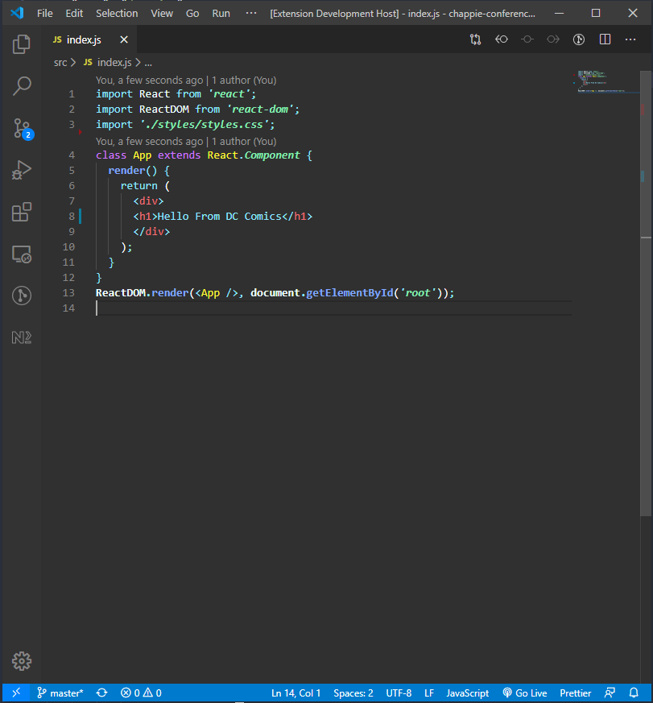

# Dc Comics theme for [Visual Studio Code](http://code.visualstudio.com)

> A dark theme for [Visual Studio Code](http://code.visualstudio.com).

## Installing

This extension is available for free in the Visual Studio Code Marketplace  

## Author

 |
:---: |
[Kalanithi Sethuraman.](https://github.com/IAmNithi) |

## Contributing

If you'd like to contribute to this theme, please read the following

1. Fork and clone this repo. `git clone https://github.com/<YOUR-USERNAME>/visual-studio-code`
2. Create a branch for your changes. `git checkout -b my-new-feature`
3. Install dependencies. `npm install`
4. Open the *visual-studio-code* folder in vscode.
5. Hack away.
6. Build and examine your changes in an Extension Development Host.
    * Debug > Start Debugging or use F5 as a shortcut
7. Commit and push your changes.
8. Submit a PR for discussion, keeping in mind that not all suggestions can be accepted.

## License

[MIT License](./LICENSE)
